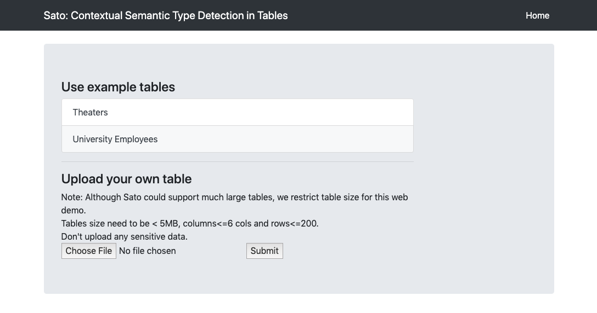
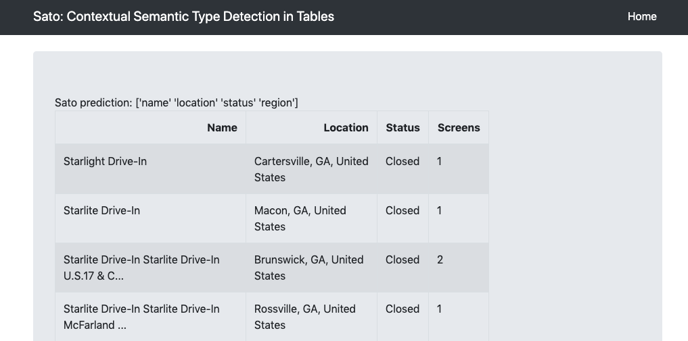

# Sato
Contextual Semantic Type Detection in Tables

## Demo
We set up a simple online [demo](http://18.191.96.23:5000/) where users can upload small tables and get semantic predictions for column types.




## Environment setup
We recommend using a python virtual environment:
```
mkdir virtualenvs
virtualenv --python=python3 virtualenvs/col2type
```
Fill in and set paths:
```
export BASEPATH=[path to the repo]
# RAW_DIR can be empty if using extracted feature files.
export RAW_DIR=[path to the raw data]
export SHERLOCKPATH=$BASEPATH/sherlock
export EXTRACTPATH=$BASEPATH/extract
export PYTHONPATH=$PYTHONPATH:$SHERLOCKPATH
export PYTHONPATH=$PYTHONPATH:$BASEPATH
export TYPENAME='type78' 

source ~/virtualenvs/col2type/bin/activate
```
Install required packages
```
cd $BASEPATH
pip install -r requirements.txt
```
To specify GPUID, use `CUDA_VISIBLE_DEVICES`. `CUDA_VISIBLE_DEVICES=""` to use CPU.

## Replicating results
Results in the paper can be replicated with and pre-trained models features we extracted.

1. Download data.
`./download_data.sh`
2. Run experiments
`cd $BASEPATH/scripts; ./exp.sh`
3. Generate plots from notebooks/FinalPlotsPaper


##  Additional 
This repo also allows training new Sato models with other hyper-parameters or extract features from additional data.


Download the [VIZNET]([https://github.com/mitmedialab/viznet](https://github.com/mitmedialab/viznet)) data and set RAW_DIR path to location of VIZNET raw data.

### Column feature extraction
```
cd $BASEPATH/extract
python extract_features.py [corpus_chunk] --f sherlock --num_processes [N]
```
corpus_chunk： corpus with potential partition post-fix, e.g. webtables0-p1, plotly-p1
N: number of processes used to extract features

### Table topic feature extraction
Download nltk data
```
import nltk
nltk.download('stopwords')
nltk.download('punkt')
```
[Optional] To train a new LDA model
```
cd topic_model
python train_LDA.py 
```
Extract topic features
```
cd $BASEPATH/extract
python extract_features.py [corpus_chunk] --f topic --LDA [LDA_name] --num_processes [N]
```
corpus_chunk： corpus with potential partition post-fix, e.g. webtables0-p1, plotly-p1
LDA_name: name of LDA model to extract topic features. Models are located in `topic_model/LDA_cache`
N: number of processes used to extract features

The extracted feature files go to `extract/out/features/[TYPENAME]` . 

### Split train/test sets

Split the dataset into training and testing (8/2). 

```
cd $BASEPATH/extract
python split_train_test.py --multi_col_only [m_col] --corpus_list [c_list]
```
m_col:`--multi_col_only` is set, filter the result and remove tables with only one column
c_list: corpus list 

Output is a dictionary with entries ['train','test'].  Dictionary values are lists of `table_id`.


### Train Sato
```
cd $BASEPATH/model
python train_CRF_LC.py -c [config_file]
```
Check out `train_CRF_LC.py` for supported configurations.